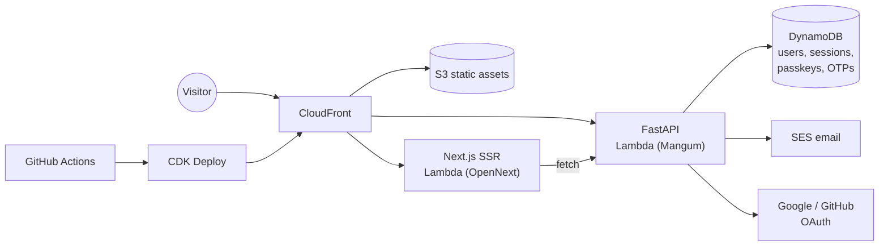
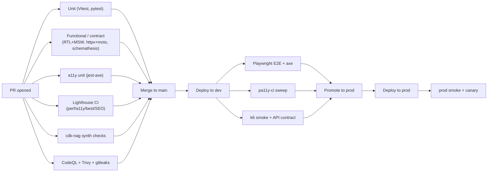
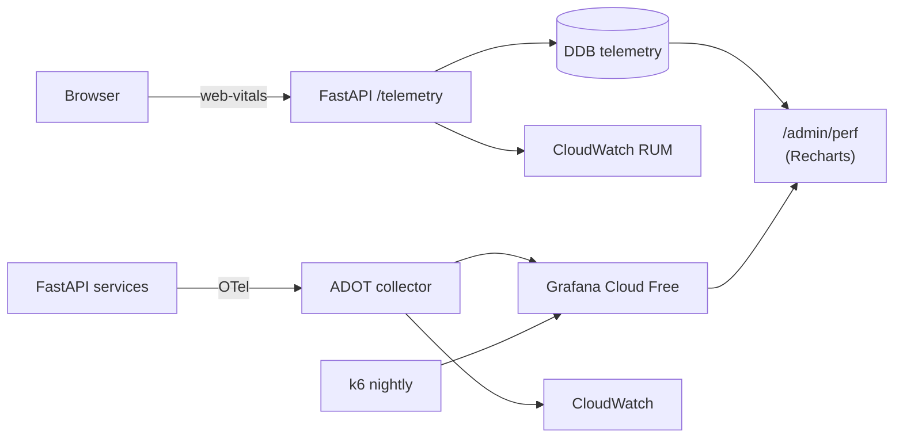
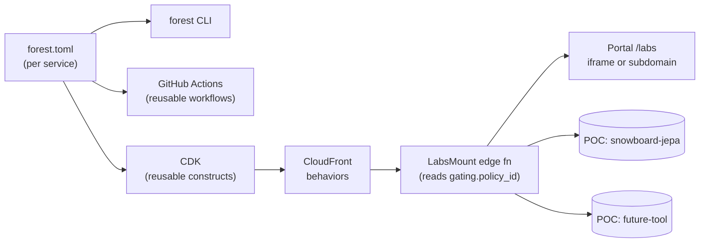

# Forest City Worlds — Bootstrap Plan

## Architecture at a glance




Single CloudFront distribution fronts both the web and `/api/*`, so the browser sees one origin (no CORS pain) and Lambda Function URLs avoid API Gateway costs (perpetual free tier friendlier than HTTP API after month 12).

## Stack decisions

- **Frontend**: Next.js 15 App Router + React 19, TypeScript strict, Tailwind v4, shadcn/ui (themed), Framer Motion, `@tanstack/react-query` for client state of API data, `next-safe-action` (or simple server actions) for mutations. Deployed via **OpenNext** to Lambda + S3 + CloudFront.
- **Backend**: **FastAPI** (Pydantic v2, uv-managed). Confirmed as the "default greenfield choice in 2026 for AI/LLM backends." Layered as Hexagonal (routers → services → repositories) so swapping persistence or auth providers later (Cognito, Postgres) is mechanical. Litestar noted as a future option for the ML inference service if we hit hot-path latency limits.
- **Auth**: custom in FastAPI, not vendor-locked, covering all four flows you asked for:
  - Email/password (argon2id via `argon2-cffi`)
  - OAuth (Google + GitHub) via `authlib`
  - Email OTP (SES) and SMS OTP (SNS, behind a feature flag — SMS is the only piece that costs money)
  - Passkeys via `py_webauthn` v2.7.1 — cross-device "login from other device" comes built-in via WebAuthn hybrid transport (browser shows QR, phone scans + biometric, BLE proximity, signed assertion). No extra code beyond standard passkey ceremonies.
- **Permissions (decoupled)**: a single shared policy module enumerated by string IDs, evaluated identically on client (`useCan('business-plan.view')` / `<Gate resource="...">`) and server (`Depends(require('business-plan.view'))`). Toggling public-vs-authed access for any view is a one-line change in the policy file.
- **Storage**: DynamoDB single-table design (perpetual free tier). Users, sessions, refresh tokens, OTP codes, passkey credentials, oauth_accounts, audit_log all live in one table partitioned by `pk`/`sk`.
- **IaC**: AWS CDK v2 (TypeScript). One stack per environment (`dev`, `prod`).
- **CI/CD**: GitHub Actions — standard checks plus an "agentic" lane (PR review agent, CDK diff explainer, AI changelog/release notes, drift detection cron). Bugbot enabled.
- **Observability**: CloudWatch Logs + AWS Distro for OpenTelemetry; structured JSON logs from FastAPI; CloudWatch RUM on the marketing site (free tier 100k events/mo).

## Repo layout

```
forest-city-worlds/
  apps/
    web/                  # Next.js 15 portal (App Router, RSC)
    api/                  # FastAPI core (auth, users, content)
  pocs/                   # Sandboxed POCs (each a self-contained service)
    _template/            # Cookie-cutter for `forest new poc <name>`
    snowboard-jepa/
      forest.toml         # Service manifest (the contract)
      api/                # Optional: FastAPI / Litestar service
      web/                # Optional: Next.js or Vite app
      infra/              # Thin CDK file composing shared constructs
      tests/
  packages/
    auth-policy/          # Shared policy IDs (mirrored to Python)
    ui/                   # Brand tokens, primitives, organic SVG motifs
    poc-shell/            # React shell for embedding POCs in /labs
    tsconfig/
    eslint-config/
  infra/
    lib/
      constructs/         # Reusable CDK constructs (PythonApi, WebApp, etc.)
      stacks/             # Per-environment top-level stacks
      manifest/           # Manifest parser + stack composer
    bin/
      forest.ts           # `forest` CLI: new / dev / deploy / graduate
  ml/                     # Reserved for PyTorch services (placeholder)
  .github/workflows/
    _reusable/            # workflow_call building blocks
      python-service.yml
      next-app.yml
      cdk-deploy.yml
      agent-review.yml
    ci.yml                # Per-PR fan-out using paths-filter + reusable wfs
    deploy.yml            # Per-service deploys driven by manifest + env
    agentic.yml
    drift.yml
  .cursor/rules/
  pnpm-workspace.yaml
  turbo.json              # Affected-only builds across apps + pocs
  package.json
  README.md
  AGENTS.md
```

## Permissions layer (the decoupling you asked for)

Single source of truth at `packages/auth-policy/src/policies.ts`:

```ts
export type Actor = 'public' | 'authed' | 'approved' | 'admin';
export const policies = {
  'home.view':              ['public'],
  'tools.overview.view':    ['public'],
  'tools.snowboard.demo':   ['public'],   // flip to ['approved'] to gate
  'business-plan.view':     ['approved'],
  'project-update.view':    ['approved'],
  'admin.dashboard':        ['admin'],
} as const;
```

- Web: a `<Gate id="business-plan.view">` wrapper + `useCan(id)` hook reads the same map; SSR pages call `assertCan(id, session)` in their loader.
- API: `Depends(require('business-plan.view'))` on every protected route.
- A tiny codegen step writes `apps/api/forest_api/_policies.py` from the TS file at build time so both sides cannot drift.

This means turning a feature public or private is a one-line PR.

## Branding direction (organic-network, not chipboard)

Token set in `packages/ui/tokens.css`:

- Greens: `forest-deep #0F2A1F`, `forest-canopy #1F4D38`, `forest-leaf #4A7C59`, `forest-moss #87A878`, `forest-spring #C5D9B0`
- Earth/warm: `bark #6B4F3A`, `mycelium-cream #F4EFE6`
- Highlight: `bioluminescent #7DF0B5` (sparingly, for "alive" hover/active states)
- Type: **Fraunces** (variable serif, optical sizing) for display + **Geist** for body/UI
- Motifs: SVG mycelium networks (procedural branching curves, no straight traces), leaf-venation dividers, layered canopy silhouettes, slow growth/branching animations on scroll. A small `<MyceliumGraph />` React component renders animated organic node-link graphs as the "we model worlds as living systems" hero visual.

## Quality bar: testing, accessibility, SOC 2, performance

These are not a final phase — they are scaffolded in Phase 0.5 and every subsequent phase respects the gates. **No deploy promotes without green checks.**

### Testing strategy (every layer, every PR)

The core pipeline is layered so feedback gets slower as it gets more expensive, and so a green PR has high confidence by the time it merges:




**Frontend (`apps/web`, `pocs/*/web`)**

- **Unit**: Vitest + React Testing Library + `@testing-library/user-event`. Pure components, hooks, utilities, the `useCan` policy logic.
- **Functional**: Vitest + RTL with **MSW** mocking the FastAPI surface. Storybook 8 with Play functions for interaction/visual coverage of every UI primitive in `packages/ui`.
- **E2E**: **Playwright** (Chromium + WebKit + Firefox). Critical journeys: marketing → signup, password login, OAuth login (with mocked IdP), email OTP, passkey register + cross-device assertion (mocked authenticator via Playwright's WebAuthn API), gated `/labs/<poc>` access, admin approval flow.
- **Visual regression**: Playwright `toHaveScreenshot()` baseline images committed; PR diffs render in the report.

**Backend (`apps/api`, POC services)**

- **Unit**: pytest + `pytest-asyncio` + Hypothesis for property-based tests on policy evaluation, token rotation, and password hashing helpers. Branch coverage via `coverage.py` with PR-blocking floor (start at 70%, ratchet up).
- **Functional**: `httpx.AsyncClient` against the FastAPI app with **moto** mocking DynamoDB/SES/SNS. The whole DDB single-table behavior gets a real exercise this way without spending money.
- **Contract**: **schemathesis** fuzzes the OpenAPI spec on every PR — catches schema/handler drift and many input-validation bugs for free.
- **Mutation testing**: `mutmut` nightly (not per-PR) on the `auth/` module to surface weak assertions.

**Cross-cutting**

- **Turbo affected graph + paths-filter** ensures only impacted services run their full suite on a PR.
- **OIDC** from GitHub Actions to AWS — no static AWS credentials in repo or org secrets (also a SOC 2 control).
- Every reusable workflow in `_reusable/` ends with a uniform `test-report` job that uploads JUnit XML so the PR comment from the agentic reviewer can summarize failures.

### Accessibility (WCAG 2.2 AA, screen-reader-first)

- **Component foundation**: shadcn/ui on top of **Radix UI primitives** — accessible-by-default keyboard nav, ARIA, focus management, dialog/menu/tooltip semantics. Custom components only when Radix doesn't cover.
- **Linting**: `eslint-plugin-jsx-a11y` (Next.js default) at error level, plus `@axe-core/react` injected in dev to log violations to console while developing.
- **Tests**:
  - Unit: `vitest-axe`/`jest-axe` assertion on every component story.
  - Storybook `@storybook/addon-a11y` runs axe in the panel on every story.
  - E2E: `@axe-core/playwright` runs on every page visited in the journey suite; **zero serious/critical violations** is a hard gate.
  - Deploy preview: **pa11y-ci** crawls every public + authed route post-deploy.
- **Lighthouse CI** thresholds (PR-blocking): a11y ≥ 95, perf ≥ 90, best-practices ≥ 95, SEO ≥ 95.
- **Patterns wired in from Phase 1**:
  - Skip-to-content link, visible focus styles (not just ring-on-hover), focus trap in dialogs.
  - Semantic landmarks (`<header>/<nav>/<main>/<footer>`), correct heading order.
  - Alt text required for all images via a Tailwind/Storybook lint rule.
  - `aria-live` regions for async toasts and OTP/passkey prompts.
  - Color contrast: every brand token combo is checked at design-token build time (script in `packages/ui/scripts/contrast-check.ts`) — fails CI if any documented pairing falls below AA.
  - `**prefers-reduced-motion`** respected by the mycelium/growth animations — fall back to static SVGs. (Important since the brand leans on motion.)
- **Manual checklist** at `docs/a11y/manual-checklist.md`: VoiceOver, NVDA, keyboard-only, 200% zoom, Windows High Contrast — done once per release branch and signed in PR description.

### SOC 2-aligned controls (free, audit-ready)

> Honest framing: SOC 2 is an *attestation* by a CPA; you cannot get the attestation for free. What we **can** do for free is implement and document the controls, so when you decide to engage an auditor (Trust Services Criteria: Security, Availability, Confidentiality at minimum), the work is mostly evidence collection rather than re-architecture. Forest City Worlds will be SOC 2-*ready* from day one.

`**compliance/` directory** (new), markdown-based control library mapped to TSC:

```
compliance/
  README.md
  controls/
    CC1-control-environment.md
    CC2-communication.md
    CC6-logical-access.md      # MFA, IAM, least privilege
    CC7-system-operations.md   # monitoring, incident response
    CC8-change-management.md   # PR + branch protection + approvals
    A1-availability.md         # backups, DR, capacity
  policies/
    information-security.md
    incident-response.md
    access-control.md
    change-management.md
    vendor-risk-register.md
    data-retention.md
  evidence/
    .gitkeep                   # auto-populated by scheduled jobs
```

**Free tooling, all wired into CI/CD**

- `**cdk-nag`** in synth: rule packs `AwsSolutions` + `NIST80053R5` (closest free analog to SOC 2 control mappings). Any unsuppressed finding fails the build; suppressions require justification comments.
- `**Checkov`** as a second-opinion IaC scanner on every PR.
- `**Prowler`** scheduled daily against the AWS account — outputs ASFF JSON; an agentic step opens issues for new HIGH/CRITICAL findings.
- **GitHub-native (free for public repos)**: CodeQL (SAST), Dependabot (deps + GH Actions), secret scanning, push protection.
- `**gitleaks`** + `**trufflehog`** on every PR (catches what GH secret scanning misses, e.g. custom token formats).
- `**Trivy`** scans Lambda images / OpenNext output for OS + lib CVEs.
- `**OSV-Scanner`** on lockfiles for an extra deps signal.
- **Branch protection**: required reviews, signed commits (Sigstore/gitsign or GPG), linear history, status checks must pass — these *are* SOC 2 change-management evidence.
- **OIDC to AWS** + **IAM Identity Center MFA** for human access — no long-lived keys anywhere.
- **CloudTrail** (1 trail, free for management events) → S3 bucket with object lock + lifecycle to Glacier — your audit log of every AWS action.
- **DynamoDB**: point-in-time recovery on user/auth tables (small but non-zero cost — recommended as the one place to spend a few cents/month for the recovery objective), KMS CMK encryption.
- **Audit log** in the existing DDB single-table for application-level events (login, role change, POC graduation) — written by FastAPI middleware, never deleted, queried by an admin route.
- **Quarterly access review** automated: a scheduled GHA opens an issue listing every IAM principal + GitHub collaborator + Cognito-equivalent user, requires admin tick-through.

This gets you the documentation pack, continuous controls monitoring, and evidence trails without spending anything beyond a few cents/month for PITR.

### Performance benchmarking + visualization

**Client (`apps/web` and POC webs)**

- `**web-vitals`** (LCP, INP, CLS, TTFB, FCP) collected in the browser, posted to a tiny FastAPI `/telemetry/web-vitals` endpoint, written to a DDB time-series table with a TTL. Same payload also tee'd to **CloudWatch RUM** (free tier 100k events/mo) for the AWS-native dashboard.
- **Lighthouse CI** GitHub Action runs on every PR (against a Vercel-style preview from a temporary CDK stack); thresholds fail the PR. History stored to LHCI Server (self-hosted on Lambda — tiny) so trends are visible.
- `**@next/bundle-analyzer`** + `**size-limit`** + `**bundlewatch`**: per-route JS budget enforced as a check.
- **Long task / hydration probes** via the `web-vitals` attribution build — surfaces the slow component in CI artifacts.

**Server (FastAPI, POC services)**

- **OpenTelemetry** auto-instrumentation (FastAPI, httpx, boto3) with the **AWS Distro for OpenTelemetry** sidecar/Lambda layer. Traces + metrics + logs.
- **Export targets**:
  - **Grafana Cloud Free** (10k metrics series, 50 GB logs, 50 GB traces, 14-day retention) — primary dashboards. Free forever.
  - **CloudWatch** as a secondary destination (free-tier metrics + dashboards) for AWS-native operators.
- **Load testing**: **k6** scripts in `tests/perf/` run nightly via GitHub Actions against the dev environment. Results stream to Grafana via the k6-Prometheus output. Per-endpoint p50/p95/p99 budgets enforced; nightly regressions open an issue with a flame-graph link.
- **Profiling on demand**: `py-spy` and `austin` available via `forest profile <service>`; flame graphs posted to the PR by the agentic reviewer when a perf-tagged PR is opened.

**In-portal performance dashboard**

- `apps/web/app/(authed)/admin/perf/page.tsx` — gated to `admin`. Renders **Recharts** of:
  - Web Vitals trends (p75, by route)
  - Bundle size over time
  - Lighthouse score history
  - API endpoint p95 latency + error rate (queried via Grafana Cloud's HTTP API)
  - k6 nightly results
- The same data drives a public, polished `/labs/perf` view (gated `approved` initially) so the perf transparency is itself a portfolio piece.




## Internal developer platform: sandboxed POCs

The principle: **one pipeline, many deliveries, declarative per service.** Every deployable unit (the core portal, a POC, a graduated product) is described by the same `forest.toml` manifest and composed from the same reusable CDK constructs and the same reusable GitHub workflows. Sandboxing comes from origin-isolation + the existing permissions layer; graduation is a manifest flip, not a rewrite.

### The contract: `forest.toml`

Each POC declares everything the platform needs to know:

```toml
# pocs/snowboard-jepa/forest.toml
[service]
name    = "snowboard-jepa"
kind    = "poc"           # core | poc | graduated
owners  = ["andrew@..."]
stage   = "labs"          # labs | staging | prod

[components.api]
runtime    = "python"
framework  = "fastapi"
entry      = "api/main.py"
memory_mb  = 512
timeout_s  = 30

[components.web]
runtime = "next"          # next | vite | static | none
root    = "web"

[mount]
# How this POC is exposed under the portal
mode        = "iframe"    # iframe | subdomain | redirect | embed
path        = "/labs/snowboard-jepa"
subdomain   = "snowboard-jepa.labs"   # used when mode=subdomain or graduated

[gating]
policy_id  = "labs.snowboard-jepa.view"
visibility = "approved"   # public | authed | approved | admin
# flipping visibility/policy_id is the only change needed to make it public,
# fully private, or admin-only

[resources]
ddb_tables_owned = [
  { name = "events", pk = "PK", sk = "SK", ttl = "expiresAt" },
]
secrets = ["GOOGLE_API_KEY"]
shared  = ["sessions"]    # references core platform tables/services

[graduation]
# When set, deploy targets switch without changing app code or workflows
target_account = "default"   # default | labs | <aws-account-id>
custom_domain  = false
```

The same schema describes `apps/web` and `apps/api` (kind=`core`). One parser, one stack composer.

### Reusable CDK constructs (`infra/lib/constructs/`)

- `PythonApi` — Lambda(zip or container) + Function URL + log group + DDB perms + secrets wiring
- `WebApp` — Next.js via OpenNext, or Vite static, or pure S3 static; CloudFront behavior
- `OwnedTables` — DDB tables declared in the manifest, with TTL/GSIs
- `LabsMount` — wires a CloudFront behavior at `path` (or a subdomain alias) plus a Lambda@Edge / CloudFront Function that enforces the manifest's `gating.policy_id` against the auth cookie before forwarding
- `ServiceStack` — composes the above from a parsed manifest; this is what every POC's `infra/` file calls

A POC's entire infra file is typically ~5 lines:

```ts
// pocs/snowboard-jepa/infra/index.ts
import { ServiceStack, loadManifest } from '@fcw/infra';
new ServiceStack(app, 'snowboard-jepa', { manifest: loadManifest(__dirname) });
```

### Reusable GitHub workflows (`.github/workflows/_reusable/`)

Standard `workflow_call` building blocks that the per-PR `ci.yml` and `deploy.yml` invoke once per affected service. New POCs inherit the entire CI/CD lane with **zero workflow code** — they only declare a manifest. The pipeline:

1. `paths-filter` + `turbo run build --filter=...[origin/main]` figures out which services changed.
2. For each changed service, fan out to the right reusable workflow based on `forest.toml` (Python service, Next app, etc.).
3. CDK deploys are scoped per-service stack, so a broken POC can't block a core deploy.

### Sandboxing model under the portal

Three mount modes, chosen per-POC in `forest.toml`. Since we're registering `forestcityworlds.com` up-front, `**subdomain` is the default**:

- `**subdomain`** (default): `<name>.labs.forestcityworlds.com`, fronted by its own CloudFront distribution + ACM cert (DNS-validated, free) + Route 53 alias record. The `LabsMount` edge function validates the auth cookie against `policy_id` before forwarding. Cleanest UX, true origin isolation, plays nicely with Service Workers and SameSite cookies.
- `**iframe`**: the `/labs/<name>` route in `apps/web` renders `<PocFrame slug="..." />` from `packages/poc-shell`, which loads the POC subdomain in a sandboxed `<iframe>` with strict CSP. Used when we want the POC to live *visually* inside the portal (sharing global nav/branding chrome). Same edge gating.
- `**redirect`**: portal links out, no embedding. For POCs that need to break out of the gating model briefly.

In all modes, **the permissions layer is identical**: `policy_id` maps to entries in `packages/auth-policy`, the `useCan`/`<Gate>` and FastAPI `require()` mechanisms are unchanged, and so is the SSR `assertCan` in the portal's `/labs/<name>/page.tsx`.

### The `forest` CLI

`infra/bin/forest.ts` (also published as `pnpm forest`):

- `forest new poc <name>` — copies `pocs/_template/`, generates a manifest, registers the policy ID, opens an initial PR.
- `forest dev <name>` — runs the POC locally with a tunneled mock of the auth cookie so gating works in dev.
- `forest deploy <name> --env labs` — synth + deploy that one service's stack.
- `forest graduate <name>` — sets `kind = "graduated"`, flips `target_account` to its own AWS account, optionally extracts the dir into a sibling repo while keeping all reusable constructs/workflows imported as a published package. This is the only step that "leaves the umbrella," and it's a manifest + account-id change rather than a rewrite.

### Multi-account posture (lightweight, deferred)

Day 1: a single AWS account, with stack name prefixes `fcw-{env}-{service}` providing logical isolation. Day N: introduce an AWS Organization with `dev`, `prod`, and `labs` accounts; CDK Pipelines + cross-account IAM. The construct & workflow code does not change — only the deploy target context. This keeps Day 1 inside free tier while leaving the door open.




## Phased delivery

### Phase 0 — Repo & tooling skeleton

- pnpm workspaces, uv for Python, Biome (or ESLint+Prettier), Ruff + mypy strict, Vitest + Pytest.
- `.cursor/rules/` with project conventions; `AGENTS.md` for agentic workflows.
- GitHub Actions `ci.yml`: typecheck, lint, test, build on every PR.

### Phase 0.5 — Quality bar (testing, a11y, security, perf)

This phase makes every later phase ship with gates already in place. Order of work:

1. **Domain + DNS**: register `forestcityworlds.com` (Route 53 or transfer in), create the public hosted zone via CDK, ACM cert (us-east-1) for `forestcityworlds.com` + `*.forestcityworlds.com` + `*.labs.forestcityworlds.com`, DNS validation. This unlocks subdomain-mode POC mounting from the very first POC.
2. **OIDC + branch protection**: GitHub→AWS OIDC role provisioned via CDK; required status checks; signed commits.
3. **Test harness**: Vitest + RTL + MSW + Storybook 8 in web; pytest + httpx + moto + Hypothesis + schemathesis in api; Playwright with axe + WebAuthn virtual authenticator.
4. **a11y baseline**: jsx-a11y, jest-axe, @axe-core/playwright, pa11y-ci, color-contrast script in `packages/ui/scripts/`, Storybook a11y addon, reduced-motion utilities.
5. **SOC 2-aligned controls**: `compliance/` directory + control docs; cdk-nag + Checkov in synth; Prowler scheduled scan; CodeQL, Dependabot, gitleaks, trufflehog, Trivy, OSV-Scanner in CI; CloudTrail + KMS + DDB PITR enabled by the core CDK stack; audit-log table + middleware.
6. **Performance & observability**: web-vitals collector + `/telemetry` endpoint; OpenTelemetry auto-instrumentation in FastAPI via ADOT; **Grafana Cloud Free workspace** provisioned now (Terraform/Grafana provider or manual one-time, then API key in AWS Secrets Manager); dashboards committed as JSON in `infra/grafana/dashboards/` and synced via the Grafana CI action on every main merge; Lighthouse CI; k6 nightly workflow with Prometheus remote-write to Grafana Cloud; bundle budgets via size-limit/bundlewatch.
7. **Reusable workflow scaffolding**: `_reusable/test-matrix.yml`, `_reusable/a11y.yml`, `_reusable/security.yml`, `_reusable/perf.yml` — each later service inherits all gates by including these.

Exit criteria: a deliberately-broken PR (e.g., adds an `` with no alt text, or adds a route that fails Lighthouse a11y, or adds an IAM `*` policy) is **blocked by CI** without anyone touching it.

### Phase 1 — Branded marketing site (public only)

- `apps/web` with hero, Tools overview (snowboard world model teaser, future tools placeholders), About, Contact, footer.
- `packages/ui` brand tokens + `<MyceliumGraph />` + organic primitives.
- Deploy via OpenNext + CDK to dev environment behind CloudFront.

### Phase 2 — Auth core in FastAPI

- DynamoDB single-table + repositories.
- Email/password + JWT access (15m) + refresh (rotating, in DDB) + secure httpOnly cookies, CSRF via double-submit.
- OAuth Google + GitHub via authlib; account linking by verified email.
- `packages/auth-policy` + codegen + `useCan` / `<Gate>` / `require()`.
- Login + signup pages on the web; "approved users" route group with SSR `assertCan`.

### Phase 3 — Authed business sections

- Business plans page, project updates feed (markdown content stored in S3, metadata in DDB).
- Admin role + minimal admin dashboard for approving users (sets `approved` claim).

### Phase 3.5 — POC platform foundations

- `forest.toml` schema + parser in `infra/lib/manifest/`.
- Reusable CDK constructs: `PythonApi`, `WebApp`, `OwnedTables`, `LabsMount`, `ServiceStack`.
- Reusable GitHub Actions in `.github/workflows/_reusable/` plus a `paths-filter`/Turbo-affected fan-out in `ci.yml` and `deploy.yml`.
- `pocs/_template/` cookie-cutter and `forest` CLI commands (`new`, `dev`, `deploy`, `graduate`).
- `apps/web/app/(authed)/labs/[slug]/page.tsx` + `packages/poc-shell` for iframe mounting, with `LabsMount` edge function enforcing `gating.policy_id`.
- Convert `apps/web` and `apps/api` to also be described by `forest.toml` so the core portal eats its own dog food (one stack composer for everything).

### Phase 4 — Passwordless & cross-device

- Email OTP via SES (`/auth/otp/email/start`, `/auth/otp/email/verify`).
- Passkey registration + authentication via `py_webauthn`. Hybrid transport gives you the QR/scan-on-phone "login from another device" flow with no extra backend code.
- SMS OTP via SNS behind a feature flag (only piece that exits free tier).

### Phase 5 — Agentic CI/CD

- `agentic.yml`: PR review + nit autofix using a Cursor Cloud Agent, CDK diff explainer ("plain English summary of infra changes"), AI changelog & release notes from conventional commits.
- `drift.yml` nightly: CDK drift detection + agentic incident report comment.
- Bugbot turned on.

### Phase 6 — First real POC: snowboard-jepa

- Created via `forest new poc snowboard-jepa` — proves the platform.
- `pocs/snowboard-jepa/` with a tiny FastAPI (or Litestar if perf-bound) inference stub, optional Vite playground web, mounted at `/labs/snowboard-jepa` in iframe mode, gated to `approved`.
- No actual JEPA training in v1; the POC ships a "coming soon" interactive that shows the planned average-motion vectorization on a cartoon avatar (deterministic mock) so the public-facing teaser on `/tools` has something concrete to link to once gating is flipped.
- `ml/` workspace stays reserved for shared training/inference code that POCs depend on.

## AWS free-tier posture

- **Perpetual free**: CloudFront (1 TB out + 10M req/mo), Lambda (1M req + 400k GB-s), DynamoDB (25 GB + 25 RCU/WCU), SES (62k emails/mo when sent from Lambda), CloudWatch Logs (5 GB), CloudWatch RUM (100k events).
- **12-month free**: S3 (5 GB), CloudFront extra, etc.
- **Planned recurring costs (small, accepted)**: Route 53 hosted zone for `forestcityworlds.com` (~$0.50/mo) — required for subdomain-mode POC mounting and a polished portfolio. Domain registration itself is ~$12–15/yr. ACM certs are free with DNS validation. DynamoDB PITR adds a few cents/month per table for recovery objective.
- **Costs money (gated by feature flag or off by default)**: SNS SMS, any GPU/Fargate ML workloads.
- API Gateway is intentionally avoided in favor of Lambda Function URLs behind CloudFront to keep routing free post-12mo.

## Key files we'll touch

Core portal + auth:

- `apps/web/app/(marketing)/page.tsx` — hero + mycelium visual
- `apps/web/app/(authed)/business-plans/page.tsx` — gated SSR page
- `apps/web/app/(authed)/labs/[slug]/page.tsx` — POC iframe mount
- `apps/web/lib/auth/policy.ts` (re-exports `packages/auth-policy`)
- `apps/web/components/Gate.tsx`, `apps/web/hooks/useCan.ts`
- `apps/api/forest_api/main.py` — FastAPI app + Mangum handler
- `apps/api/forest_api/auth/{password,oauth,otp,passkey}.py`
- `apps/api/forest_api/auth/policy.py` (codegen target)
- `apps/api/forest_api/repositories/users.py` (DDB)

Shared packages + branding:

- `packages/ui/tokens.css`, `packages/ui/components/MyceliumGraph.tsx`
- `packages/auth-policy/src/policies.ts`
- `packages/poc-shell/src/PocFrame.tsx`

POC platform + IaC:

- `infra/lib/manifest/{schema.ts,parser.ts,compose.ts}` — `forest.toml` parser + stack composer
- `infra/lib/constructs/{PythonApi,WebApp,OwnedTables,LabsMount,ServiceStack}.ts`
- `infra/lib/stacks/{core-portal,labs}.ts`
- `infra/bin/forest.ts` — `forest` CLI
- `pocs/_template/forest.toml`, `pocs/_template/{api,web,infra}/`

Pipelines:

- `.github/workflows/_reusable/{python-service,next-app,cdk-deploy,agent-review,test-matrix,a11y,security,perf}.yml`
- `.github/workflows/{ci,deploy,agentic,drift,nightly-load,nightly-prowler}.yml`
- `turbo.json`

Quality, security, performance:

- `apps/web/playwright.config.ts`, `apps/web/tests/e2e/`**, `apps/web/tests/a11y/`**
- `apps/web/lighthouserc.json`, `apps/web/.size-limit.json`
- `apps/api/tests/{unit,functional,contract}/**`, `apps/api/conftest.py` (moto fixtures)
- `apps/api/forest_api/telemetry/{web_vitals.py,otel.py,audit_log.py}`
- `tests/perf/k6/{auth-smoke,labs-snowboard}.js`
- `packages/ui/scripts/contrast-check.ts`, `packages/ui/src/motion/reducedMotion.ts`
- `compliance/{README.md,controls/**,policies/**}`
- `infra/lib/constructs/{Observability,SecurityBaseline,AuditTrail}.ts`
- `infra/grafana/dashboards/*.json` (committed dashboards)
- `apps/web/app/(authed)/admin/perf/page.tsx` (Recharts perf dashboard)

